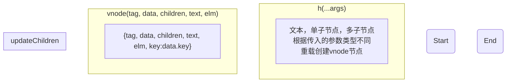
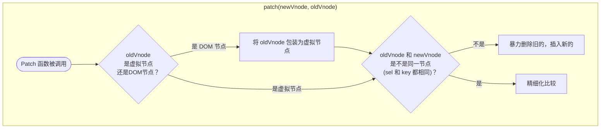
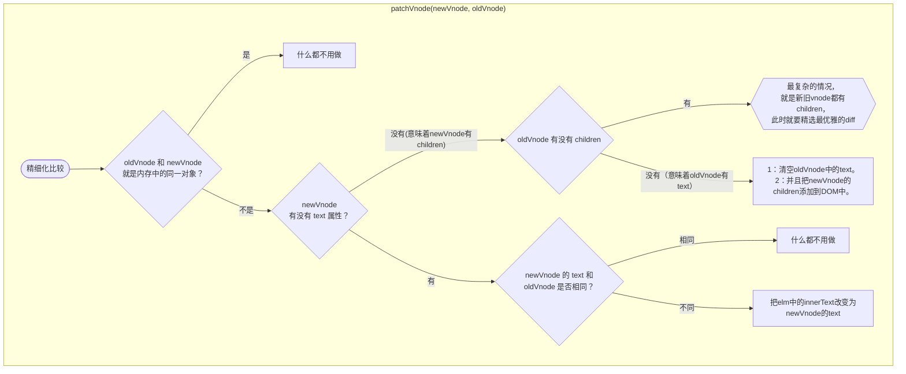
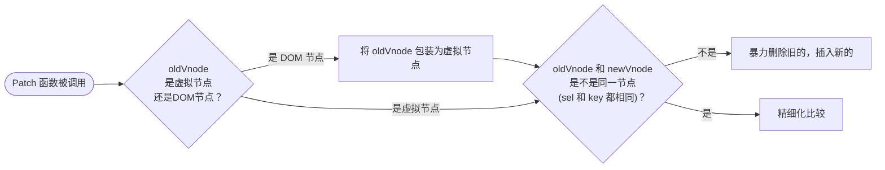
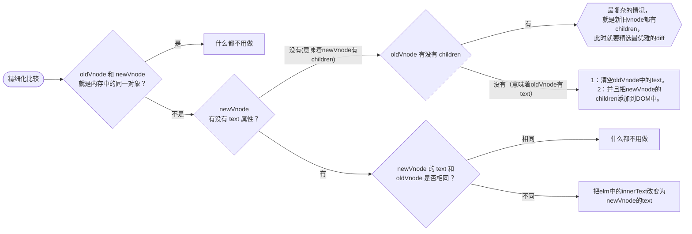
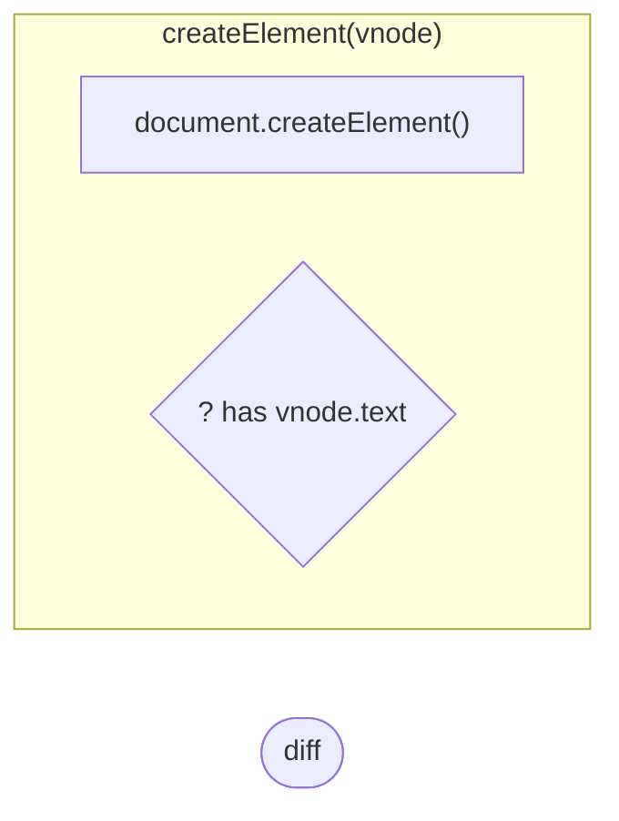
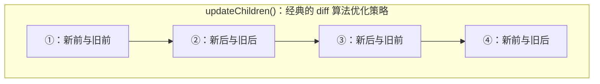
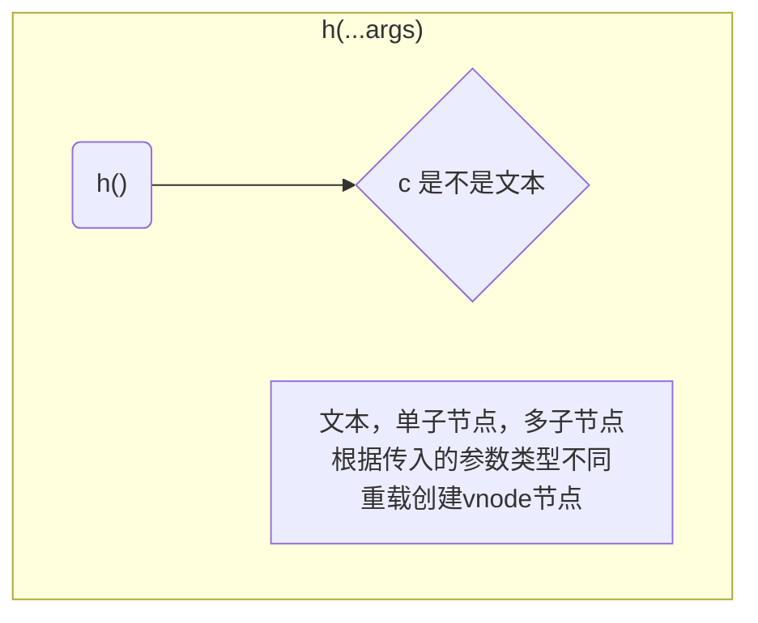

# simple-snabbdom















## Visual DOM（虚拟 DOM）

## h 函数

```javascript
h(sel, data, c);
```



**示例**

```js
h("div", {}, "Hello");
h("div", {}, h("p", {}, "Welcome"));
h("ul", {}, [h("li", {}, "A"), h("li", {}, "B")]);
```

## diff 更新节点 patch

## 递归创建子节点 createElement

## diff 更新子节点

## 子节点更新策略
